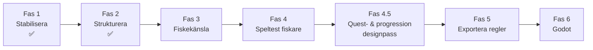

# Fiskespel — Development Roadmap

Den här roadmapen beskriver hur vi tar **Munksjön-prototypen** (`index.html`) från balansverktyg till **riktigt spel i Godot**. Prototypen är en **testmaskin** för fiskekänsla och balans — inte produktionskod och inte en webb-3D-motor.

**Principer:**

- Finjustera odds, fight, progression och UX i HTML-prototypen så länge det går snabbt.
- Dokumentera regler och formler så de kan byggas om i Godot utan att gissa.
- Bygg **inte** om prototypen till Vite/TypeScript.
- Bygg **inte** en 3D-motor i webben — det riktiga spelet skapas i **Godot 4**.

---

## Översikt

```
Fas 1 ──► Fas 2 ──► Fas 3 ──► Fas 4 ──► Fas 5 ──► Fas 6
Stabilisera  Strukturera  Fiskekänsla  Speltest    Exportera   Godot
(KLAR)       (KLAR)       & balans     fiskare     regler      rebuild
```

| Fas | Namn | Status | Primärt resultat |
|-----|------|--------|------------------|
| 1 | Stabilisera prototypen | **KLAR** | Sparbar demo, städad kodbas, dokumentation |
| 2 | Strukturera koden | **KLAR** | Tydliga JS-sektioner, balansvärden lätta att hitta |
| 3 | Färdigställ fiskekänsla och balans | Pågår / nästa | Verifierad känsla, level 1–5 ≈ 25 min |
| 4 | Speltest med riktiga fiskare | Planerad | Kalibrerade konstanter utifrån extern feedback |
| 4.5 | Quest- och progressionssystem (designpass) | Planerad (separat) | Designspec för quest-driven progression, maxlevel ~50 |
| 5 | Exportera reglerna | Planerad | Formler och systemlogik i Godot-vänligt format |
| 6 | Bygg om i Godot | Planerad | Godot-projekt enligt koncept + prototyp som ritning |

---

## Fas 1 — Stabilisera prototypen ✅ KLAR

**Mål:** Göra prototypen tillförlitlig som testverktyg utan att ändra dess roll.

### Utfört / leverabler

- [x] Refaktorerad `index.html` som enda spelfil
- [x] Tydlig kodstruktur med kommenterade sektioner
- [x] `PROJECT_OVERVIEW.md`, `TECHNICAL_ARCHITECTURE.md`, `DEVELOPMENT_ROADMAP.md`
- [ ] `localStorage`-sparning av framsteg *(rekommenderat nästa steg om inte redan implementerat)*
- [ ] Båtköp i shop om trolling ska testas fullt ut

### Exitkriterier

- Spelare kan testa alla metoder och progression utan att tappa kontext mellan sessioner
- Dokumentation beskriver prototypen som **balansverktyg**, inte slutprodukt

---

## Fas 2 — Strukturera koden ✅ KLAR

**Mål:** Göra balansvärden och spellogik lätta att hitta, justera och förklara.

### Kodsektioner i `index.html`

| Sektion | Innehåll |
|---------|----------|
| **KONFIGURATION** | `BITE_CEILING`, `ODDS_SATURATION`, XP-kurva, haptik |
| **ARTDATA** | Arter, metoder, tider, platser, utrustning |
| **SPELSTATE** | `gameState`, `sceneState`, runtime-variabler |
| **FÅNGSTMOTOR** | Nappchans, artval, storlek, kast, fight |
| **EKONOMI** | Försäljning, shop, valutor |
| **PROGRESSION** | XP, levelup, upplåsningar |
| **FISKELOGG** | Rekord, storleksklasser |
| **UI** | Canvas, HUD, shop, modal |
| **EVENTHANTERING** | Input och init |

### Exitkriterier

- En designer/utvecklare kan justera `TAK`, `K`, XP-bas m.m. utan att leta i renderingskod
- Variabelnamn på engelska, spelartext på svenska

---

## Fas 3 — Färdigställ fiskekänsla och balans

**Mål:** Prototypen ska ge **tillförlitlig designdata** för Godot — inte visuell polish.

### Fokusområden

| Område | Vad som ska kännas rätt |
|--------|-------------------------|
| **Hugg** | Hookset-fönster, artspecifik haptik, missade hugg |
| **Fight** | Spänning, rusningar, ge lina vs reva, linbrott |
| **Nappfrekvens** | `BITE_CEILING`, `ODDS_SATURATION`, metod/plats/tid, spöbonus |
| **Storleksmodell** | `sizeReach`, kvalitet, stor/bra/liten utan rekordfisk på låg level |
| **Progression** | Level 1→5 ≈ **25 min** aktivt fiske med nuvarande XP-kurva |

### Uppgifter

| # | Uppgift |
|---|---------|
| 3.1 | Speltestprotokoll: mät tid level 1→5 med neutralt upplägg |
| 3.2 | Justera `XP_BASE`, `BITE_CEILING`, `ODDS_SATURATION` tills måltempo nås |
| 3.3 | Verifiera att varje art känns distinkt i fight (haptik + stamina/runs) |
| 3.4 | Verifiera metodskillnad (mete vs spinn vs jig vs troll) |
| 3.5 | Logga ändrade konstanter i en **balansjournal** (datum, värde, varför) |
| 3.6 | Bekräfta att shop/ekonomi inte snedvrider nappfrekvens vs storlek (spö = frekvens, upplägg = storlek) |

### Leverabler

- [ ] Balansjournal med godkända standardvärden
- [ ] Speltestprotokoll ifyllt (minst 3 interna pass)
- [ ] Sign-off: “känslan är tillräcklig för att skriva spec”

### Exitkriterier

- Level 1→5 ligger inom **20–30 min** vid avsett spelsätt
- Teamet kan beskriva varje kärnformel utan att läsa implementationen rad för rad
- Inga kända P0-buggar i kärnloopen (kast → napp → fight → belöning)

### Beroenden

- Fas 1 och 2 klara

---

## Fas 4 — Speltest med riktiga fiskare

**Mål:** Extern validering — att känslan och tempot fungerar för målgruppen, inte bara för teamet.

### Uppgifter

| # | Uppgift |
|---|---------|
| 4.1 | Rekrytera 5–10 testfiskare (bland nybörjare och erfarna) |
| 4.2 | Ge testare en enkel instruktion — inga dev-verktyg |
| 4.3 | Samla kvalitativ feedback: napp, fight, progression, frustration |
| 4.4 | Samla kvantitativ data: tid till level 5, antal kast per fångst, metodval |
| 4.5 | Kalibrera `XP_BASE` och balansvärden utifrån feedback |
| 4.6 | Prioritera ändringar: endast det som påverkar **regler**, inte webb-UI |

### Leverabler

- [ ] Speltestrapport med citat och rekommenderade konstantjusteringar
- [ ] Uppdaterad balansjournal (version “fiskare-validated”)
- [ ] Lista över medvetna avvikelser (saker vi accepterar i prototypen men inte i Godot)

### Exitkriterier

- Testfiskare förstår loopen utan förklaring efter < 2 min
- Ingen dominerande frustration kring “inget napp” eller “för lätt linbrott” utan att det går att justera med konstanter
- Godkända balansvärden frysta som **referens för Fas 5**

### Beroenden

- Fas 3 exitkriterier uppfyllda

---

## Fas 4.5 — Quest- och progressionssystem (separat designpass)

**Mål:** Designa ett **quest-drivet progressionssystem** inspirerat av MMO-spel (t.ex. World of Warcraft), där spelaren leds framåt genom uppdrag snarare än enbart fri grind. Detta är ett **större designpass som planeras separat** och påbörjas **EFTER att kärnloopen (kasta, fånga, fight, ekonomi) är validerad och balanserad** i prototypen (dvs. efter Fas 3–4). Här skrivs **design och spec** — implementation hör hemma i Godot (Fas 6).

> ⚠️ **Viktig ordningsföljd:** Lås inte XP-kurva eller upplåsningsnivåer kring quests förrän kärnloopens känsla och tempo är bekräftade. Annars riskerar vi att kalibrera progression mot en loop som fortfarande ändras.

### Designprinciper

- **Startkit + styrd start:** Spelaren börjar med ett enkelt startkit (startspö + mask) och får tidiga uppdrag som lär ut loopen, istället för att kastas in i öppen grind.
- **Quests som ryggrad:** Progression byggs primärt genom uppdrag (quests), inte bara genom att samla XP/kronor fritt. Grind finns kvar som komplement, men questkedjan är den röda tråden.
- **MMO-inspirerad känsla:** Tydliga mål, stegvisa belöningar, “nästa quest”-morot — som questloggen i WoW, fast kring fiske.

### Innehåll att designa

| Område | Beskrivning |
|--------|-------------|
| **Tidiga quests** | Enkla, lärande mål, t.ex. *“Fånga 10 mörtar”* innan en viss level, *“Fånga din första abborre”*, *“Sälj fångst för X kr”*. |
| **Questkedjor** | Sekvenser som leder spelaren genom metoder och platser (mete → spinn → vertikal/troll) i takt med att utrustning låses upp. |
| **Utrustning via quests** | Spön och annan utrustning kan låsas upp **via quests**, inte bara via *level + kronor*. Ett spö kan kräva en avklarad quest som “nyckel”, varefter det ev. fortfarande köps för kronor. |
| **Belöningstyper** | Quests kan ge XP, kronor, bete, spö-upplåsning, titlar/troféer, samt åtkomst till nya platser. |
| **Höjd maxlevel** | Riktmärke runt **level 50** (mot dagens lägre tak). Ger plats för en längre, questdriven resa. |
| **Omskriven XP-kurva** | XP-kurvan (`XP_LEVEL_BASE`, `XP_LEVEL_GROWTH`) skrivs om för att passa ~50 levels och questtempo, så det inte blir en platt grind i mitten. |
| **Omskrivna upplåsningsnivåer** | Spö-gates justeras kring quest/level-mixen, t.ex. **Bättre metspö ~level 5**, **Spinnspö ~level 10–15**, båt-spön betydligt senare. Värdena sätts som platshållare och kalibreras. |

### Uppgifter

| # | Uppgift |
|---|---------|
| 4.5.1 | Definiera quest-datamodell (id, mål, villkor, belöning, förkrav, level-gate) |
| 4.5.2 | Skissa den tidiga questkedjan (onboarding → första metodbyten → första båt) |
| 4.5.3 | Designa upplåsningsmatris: vad som gates av **quest**, av **level**, av **kronor**, eller en kombination |
| 4.5.4 | Föreslå ny XP-kurva och levelband för maxlevel ~50 (platshållarvärden) |
| 4.5.5 | Mappa om spö-/utrustnings-gates (Bättre metspö ~5, Spinnspö ~10–15, båt-spön senare) |
| 4.5.6 | Beskriva quest-UI på konceptnivå (questlogg, spårning, “klar”-flöde) — ej webbimplementation |

### Leverabler

- [ ] Designdokument: `specs/quest_system.md` (datamodell, kedjor, belöningar)
- [ ] Upplåsningsmatris (quest vs level vs kronor)
- [ ] Förslag på XP-kurva och upplåsningsnivåer för maxlevel ~50 (platshållare)

### Exitkriterier

- Quest-systemet är **specat** tillräckligt för att kunna implementeras i Godot utan att gissa
- Progressionsbågen (level 1 → ~50) är beskriven med tydliga milstolpar och questberoenden
- Beslut dokumenterat om vad som **inte** ska prototypas i HTML (questsystemet byggs i Godot, inte i `index.html`)

### Beroenden

- **Fas 3 och Fas 4 klara** — kärnloopen ska vara validerad och balanserad innan progression låses kring quests
- Påverkar Fas 5 (reglerna som exporteras) och Fas 6 (Godot-implementation)

---

## Fas 5 — Exportera reglerna

**Mål:** Prototypens JavaScript ska **inte** portas — reglerna ska **dokumenteras** så Godot kan implementera dem rent.

### Exportera (minimikrav)

| Dokument / artefakt | Innehåll |
|---------------------|----------|
| **Formelspec** | `computeRawWeight`, `computeBiteOdds`, `pickSpeciesAndSize`, fight-tick, `xpRequiredForLevel`, `getLevelFactors` |
| **Datatabeller** | Arter, metoder, tider, platser, spön — som JSON eller markdown-tabeller |
| **Tillståndsmaskin** | `sceneState.mode` och övergångar |
| **Balansjournal** | Slutgiltiga konstanter med motivering |
| **Känsloregler** | Haptikmönster, rusningar, fake nibbles — beskrivet beteende, inte DOM-kod |

### Önskat format för Godot

```
docs/
├── balance/
│   ├── constants.json          # TAK, K, XP_BASE, GEAR_CAP, …
│   ├── species.json
│   ├── methods.json
│   ├── times.json
│   └── spots.json
├── specs/
│   ├── bite_engine.md
│   ├── fight_engine.md
│   ├── progression.md
│   └── state_machine.md
└── playtest/
    └── balance_journal.md
```

### Uppgifter

| # | Uppgift |
|---|---------|
| 5.1 | Skriv `bite_engine.md` med alla formler och exempel (in-/utdata) |
| 5.2 | Skriv `fight_engine.md` med variabler, runs, snap/surface |
| 5.3 | Exportera art-/metoddata till JSON som matchar prototypen exakt |
| 5.4 | Verifiera JSON mot prototyp: samma napp% och storleksfördelning vid givet seed/upplägg |
| 5.5 | Beskriv avsiktligt **inte** portat: canvas-ritning, Three.js-shop, CSS |

### Exitkriterier

- En Godot-utvecklare kan implementera FÅNGSTMOTOR + PROGRESSION utan att läsa `index.html`
- Alla tunable constants finns på ett ställe utanför prototypen
- Minst ett manuellt verifierat exempel per kärnformel ( “givet X → förväntat Y” )

### Beroenden

- Fas 4: frysta balansvärden

---

## Fas 6 — Bygg om i Godot

**Mål:** Skapa det riktiga spelet i **Godot 4** med prototypen och Fas 5-specarna som ritning.

### Scope (initial Godot-vertical)

- Kärnloop: upplägg → kast → napp → fight → landning → belöning
- Portade regler från Fas 5 (inte kopierad JS)
- En referensmiljö (Munksjön) — enkel 3D, fokus på gameplay
- Progression, logg, grundläggande ekonomi

### Medvetet senare i Godot (ej blockerande för vertical)

- Hundratals sjöar och datadriven värld
- SMHI/SLU-integration
- Båt/kajak, full väder/årstid
- Skalbar content pipeline

### Uppgifter

| # | Uppgift |
|---|---------|
| 6.1 | Godot 4-projektstruktur (`scenes/`, `scripts/`, `data/`, `assets/`) |
| 6.2 | Implementera bitespec i GDScript |
| 6.3 | Implementera fightspec med artspecifika profiler |
| 6.4 | Input för mobil + PC (touch + mus/tangentbord) |
| 6.5 | Spara/ladda spelstate |
| 6.6 | Enkel 3D-scen: vatten, strand, kastbåge, lure |
| 6.7 | Regression: jämför Godot vs prototyp på samma upplägg (napp%, fightlängd) |

### Exitkriterier

- Spelbar vertical slice i Godot med **samma regler** som frysta prototypvärden
- `index.html` arkiveras som referens — uppdateras endast för balans om spelet i Godot skiljer sig och prototypen behövs för A/B

### Beroenden

- Fas 5 komplett

---

## Beroendegraf



**Parallellt arbete:** Tidig Godot-spike (teknik, vatten, input) kan påbörjas sent i Fas 5 om specs skrivs löpande — men **balans ska inte låsas i Godot förrän Fas 4 är klar**.

---

## Teststrategi

| Fas | Vad testas | Hur |
|-----|------------|-----|
| **1–2** | Prototypen går att spela; sektioner går att navigera | Manuell smoke test |
| **3** | Känsla, tempo, napp/fight/storlek | Strukturerat internt speltest + tidmätning level 1→5 |
| **4** | Målgruppsacceptans, kalibrering | Externa testfiskare, enkät + sessionlogg |
| **5** | Regler är kompletta och korrekta | Formel-exempel, JSON vs prototyp (samma inputs → samma outputs) |
| **6** | Godot matchar specs | Regression mot Fas 5-exempel; playtest av vertical slice |

**Medvetet utelämnat i prototyp-faserna:** enhetstester i CI, Vite, TypeScript, webb-3D-prestanda.

---

## Scope — vad vi inte gör

| Avböjt | Varför |
|--------|--------|
| Vite + TypeScript-refaktor | Prototypen ska vara lätt att tweaka, inte produktionsarkitektur |
| 3D-motor i webben | Riktigt spel byggs i Godot |
| Unity / Unreal | Beslut: Godot 4 |
| Content pipeline för hundratals sjöar | Kommer efter Godot-vertical, inte i prototyp-faserna |

---

## Dokumentation

Uppdatera vid fasövergång:

- `PROJECT_OVERVIEW.md` — produktvision och prototyp vs Godot
- `TECHNICAL_ARCHITECTURE.md` — prototypsektioner + målarkitektur Godot
- Denna fil — status per fas

---

*Senast uppdaterad: juni 2025. Fas 1–2 markerade KLAR; Fas 3 är nästa aktiva fas. Fas 4.5 (quest- och progressionssystem) tillagd som separat designpass efter validerad kärnloop.*
