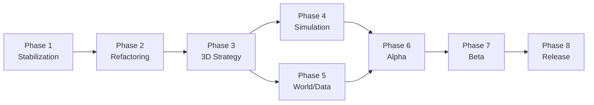

# Fiskespel — Development Roadmap

This roadmap defines eight phases from prototype stabilization through release preparation. Each phase has clear goals, deliverables, exit criteria, and dependencies. Timelines are indicative and assume a small team (1–3 developers); adjust proportionally for team size.

**Guiding principle:** Preserve the validated game design from the Munksjön prototype while rebuilding architecture, rendering, and content systems for scale.

---

## Roadmap Overview

```
Phase 1 ──► Phase 2 ──► Phase 3 ──► Phase 4 ──► Phase 5
Stabilize    Refactor     3D Engine   Simulation   World/Data
                                              │
                    Phase 6 ◄─────────────────┘
                    Alpha
                      │
              Phase 7 ──► Phase 8
              Beta         Release Prep
```

| Phase | Name | Indicative Duration | Primary Output |
|-------|------|---------------------|----------------|
| 1 | Prototype Stabilization | 2–4 weeks | Reliable demo with persistence |
| 2 | Architecture Refactoring | 4–6 weeks | Modular, tested codebase |
| 3 | 3D Engine Migration Strategy | 3–4 weeks | Engine choice + vertical slice plan |
| 4 | Fishing Simulation Systems | 8–12 weeks | Deep sim modules |
| 5 | World and Data Integration | 8–12 weeks | Location pipeline + real data |
| 6 | Alpha Version | 6–8 weeks | Playable 3D Munksjön alpha |
| 7 | Beta Version | 10–14 weeks | Multi-location beta |
| 8 | Release Preparation | 6–10 weeks | Store-ready build |

**Total indicative range:** 18–24 months to release, depending on team size and scope cuts.

---

## Phase 1: Prototype Stabilization

**Goal:** Make the existing single-file prototype reliable, measurable, and usable as a persistent reference demo — without changing the fundamental architecture yet.

### Objectives

- Fix known gaps in the current prototype experience
- Add session persistence so playtesting accumulates meaningful progress
- Establish baseline documentation and project hygiene
- Instrument the prototype for design validation

### Tasks

| # | Task | Priority |
|---|------|----------|
| 1.1 | Add `localStorage` save/load for `G` state (level, currency, log, equipment) | High |
| 1.2 | Implement boat purchase in shop (kr cost, sets `G.boat = true`) | High |
| 1.3 | Cache shop thumbnails by rod/skin combo to avoid redundant PNG generation | Medium |
| 1.4 | Add basic error handling for Three.js CDN failure (user-visible message) | Medium |
| 1.5 | Remove stray `Untitled` file; add README pointing to docs | Low |
| 1.6 | Pin Three.js with Subresource Integrity (SRI) hash or vendor locally | Medium |
| 1.7 | Document all tunable constants (`TAK`, `K`, `GOLV`, XP curve) in GDD appendix | High |
| 1.8 | Manual playtest checklist covering all methods, species, and unlock paths | High |

### Deliverables

- [ ] Persistent prototype (progress survives refresh)
- [ ] Complete boat unlock → trolling flow
- [ ] `PROJECT_OVERVIEW.md`, `TECHNICAL_ARCHITECTURE.md`, `DEVELOPMENT_ROADMAP.md` (this set)
- [ ] Playtest checklist and constant tuning log

### Exit Criteria

- A new tester can play for 30+ minutes across multiple sessions without losing progress
- All four fishing methods are reachable and completable
- Documentation accurately describes the prototype

### Risks

- Over-investing in prototype code that will be replaced — keep changes minimal and clearly scoped

---

## Phase 2: Architecture Refactoring

**Goal:** Extract the monolithic `index.html` into a maintainable modular structure while preserving identical gameplay behavior.

### Objectives

- Introduce build tooling and TypeScript
- Separate simulation logic from rendering and UI
- Add automated tests for core game math
- Prepare a portable `core` package for engine migration

### Tasks

| # | Task | Priority |
|---|------|----------|
| 2.1 | Initialize project with Vite + TypeScript | High |
| 2.2 | Split into modules: `config/`, `sim/`, `state/`, `ui/`, `render/canvas2d/`, `render/shop3d/` | High |
| 2.3 | Extract static data to JSON files (`species.json`, `methods.json`, etc.) | High |
| 2.4 | Port `odds()`, `pickAndSize()`, `fightTick()`, `xpNeed()`, `lf()` to `packages/core` | High |
| 2.5 | Unit tests for odds engine (bite rate bounds, quality scoring, size distribution) | High |
| 2.6 | Unit tests for fight outcomes (snap threshold, stamina depletion, run cycles) | High |
| 2.7 | Replace `innerHTML` with DOM templating or safe HTML utilities | Medium |
| 2.8 | Introduce typed interfaces for `G`, `SC`, species, methods | High |
| 2.9 | CI pipeline: lint, typecheck, test on push | Medium |
| 2.10 | Maintain visual parity with original prototype (screenshot diff or manual sign-off) | High |

### Target module structure

```
src/
├── config/          # JSON loaders, constants
├── sim/
│   ├── odds.ts
│   ├── catch.ts
│   ├── fight.ts
│   └── progression.ts
├── state/
│   ├── gameState.ts
│   └── saveService.ts
├── ui/
├── render/
│   ├── canvas/
│   └── shop/
└── main.ts
```

### Deliverables

- [ ] Modular TypeScript codebase with Vite dev server
- [ ] `packages/core` with 80%+ test coverage on simulation functions
- [ ] JSON-driven species, methods, spots, times, gear
- [ ] GitHub Actions CI

### Exit Criteria

- All prototype gameplay behavior matches pre-refactor baseline
- Simulation modules have zero DOM/Canvas dependencies
- A developer can modify species data in JSON without touching logic code

### Dependencies

- Phase 1 complete (persistence and docs in place)

---

## Phase 3: 3D Engine Migration Strategy

**Goal:** Select a production game engine and define the migration path from 2D canvas to 3D environments — without committing to full content production yet.

### Objectives

- Evaluate engines against project requirements
- Build a technical spike proving shore casting in 3D water
- Define asset pipeline and project template
- Plan coexistence or cutover from web prototype

### Engine evaluation criteria

| Criterion | Weight | Notes |
|-----------|--------|-------|
| Water rendering quality | High | Lakes, rivers, coastal |
| Terrain/GIS import | High | Swedish elevation and shoreline data |
| Mobile performance | High | Prototype is mobile-first |
| Team familiarity | Medium | Learning curve budget |
| Asset pipeline | Medium | GLTF, modular gear |
| Licensing cost | Medium | Indie-friendly |
| Multiplayer (future) | Low | Not in initial scope |

### Recommended candidates

1. **Unity (URP)** + Crest/Ocean or similar water asset
2. **Unreal Engine 5** + Water plugin
3. **Godot 4** — fallback if team prioritizes open source and lighter builds

### Tasks

| # | Task | Priority |
|---|------|----------|
| 3.1 | Write engine decision document with scored comparison | High |
| 3.2 | One-week spike: simple lake mesh, water surface, shore camera, cast arc | High |
| 3.3 | Spike: import `packages/core` sim logic into engine (C# or GDScript bindings) | High |
| 3.4 | Define folder structure and coding conventions for engine project | High |
| 3.5 | Prototype rod/lure rendering approach (GLTF vs procedural) | Medium |
| 3.6 | Target platform matrix (WebGL? Mobile native? PC?) | High |
| 3.7 | Performance budget document (draw calls, fish agents, draw distance) | Medium |
| 3.8 | Migration cutover plan: retire canvas client vs maintain web demo | Medium |

### Deliverables

- [ ] Engine Decision Record (ADR)
- [ ] 3D vertical slice spike (video + repo branch)
- [ ] Engine project template with sim integration
- [ ] Platform and performance budget doc

### Exit Criteria

- Team agrees on engine and primary platform targets
- Spike demonstrates cast → lure in water → bite trigger in 3D
- `packages/core` runs inside engine with matching bite/fight results to web tests

### Dependencies

- Phase 2 complete (portable sim core)

---

## Phase 4: Fishing Simulation Systems

**Goal:** Replace probabilistic placeholder mechanics with a deep, extensible fishing simulation that supports realistic species behavior and gear interaction.

### Objectives

- Evolve bite model from random rolls to environment- and behavior-aware decisions
- Expand fight system with species-specific profiles
- Implement gear depth (line, lures, rod properties beyond bite frequency)
- Add audio and haptic layers

### Simulation layers

```
Layer 4: Fight        — tension, runs, jumps, structure break-offs
Layer 3: Bite         — lure match, presentation, fish mood
Layer 2: Fish agent   — position, depth, hunger, fear, species AI
Layer 1: Population   — density, size distribution, stocking
Layer 0: Environment  — time, season, temp, weather, habitat
```

### Tasks

| # | Task | Priority |
|---|------|----------|
| 4.1 | `EnvironmentSim` — extend TIMES model to full state vector | High |
| 4.2 | `FishPopulation` — habitat-based density and size distribution | High |
| 4.3 | `FishAgent` — basic state machine (idle, feeding, fleeing, hooked) | High |
| 4.4 | `BiteSimulator` v2 — lure profile vs species preference matrix | High |
| 4.5 | `FightController` v2 — species profiles (pike long runs, perch head shakes) | High |
| 4.6 | Gear system — line weight, lure types, hook sizes (gameplay + UI) | Medium |
| 4.7 | Method controllers — port mete, spinn, jig, troll to engine input | High |
| 4.8 | Audio system — water ambient, cast, splash, reel, species fight cues | Medium |
| 4.9 | Haptic profiles — port `HAP` patterns to native/platform APIs | Low |
| 4.10 | Remote config for tunable constants (`TAK`, `K`, XP curve) | Medium |
| 4.11 | Automated sim tests — regression suite for bite rates and fight duration | High |

### Deliverables

- [ ] Documented simulation API with layer diagram
- [ ] Fish agent prototype in test harness (headless or debug view)
- [ ] Fight profiles for all five starter species
- [ ] Gear and lure data schema
- [ ] Audio pass on core actions

### Exit Criteria

- Bite decisions respond measurably to environment changes (e.g., dawn improves gädda activity)
- Each species has distinguishable fight feel
- Sim regression tests pass in CI

### Dependencies

- Phase 3 complete (engine + sim integration)

---

## Phase 5: World and Data Integration

**Goal:** Build the content pipeline and integrate real Swedish geographic and ecological data so locations are authored as data, not as one-off scenes.

### Objectives

- Define location pack format and validation tooling
- Integrate first real data sources for Munksjön
- Build habitat tagging on spatial cells
- Establish content authoring workflow

### Data sources (investigate licensing early)

| Source | Data type |
|--------|-----------|
| SLU | Species distribution, regulations, stocking |
| SMHI | Weather, temperature, hydrology |
| Lantmäteriet / open geodata | Shorelines, elevation, orthophotos |
| Sportfiske record databases | Trophy weights for record tiers |

### Tasks

| # | Task | Priority |
|---|------|----------|
| 5.1 | Finalize JSON schemas for locations, species, regulations | High |
| 5.2 | Build `content-tools` CLI: validate, pack, publish location bundles | High |
| 5.3 | Import pipeline: GeoJSON shoreline → terrain mesh | High |
| 5.4 | Bathymetry integration (raster → depth mesh or volume) | Medium |
| 5.5 | Habitat cell generator — auto-tag vass, rev, djup from depth/slope | High |
| 5.6 | Munksjön location pack v1 with real boundary and placeholder bathymetry | High |
| 5.7 | Regional species table — map prototype species to Latin IDs and eco regions | High |
| 5.8 | Regulations module — seasons, minimum sizes (read-only display first) | Medium |
| 5.9 | CDN publish workflow for location packs | Medium |
| 5.10 | Content QA checklist — species match eco region, no orphan references | High |

### Spatial hierarchy

```
Region (e.g., SE-F)
  └── WaterBody (munksjon)
        └── SubArea (north_bay, south_shore, …)
              └── HabitatCell (grid cell with tags and depth)
```

### Deliverables

- [ ] JSON Schema files with validation in CI
- [ ] `content-tools` CLI documented
- [ ] Munksjön location pack v1 on CDN
- [ ] Authoring guide for adding a new lake

### Exit Criteria

- A new lake can be added by supplying GeoJSON + species table + habitat rules without engine code changes
- Munksjön loads from data pack with correct shoreline and habitat tags
- All content passes automated validation

### Dependencies

- Phase 4 in progress (sim layers consume habitat and environment data)

---

## Phase 6: Alpha Version

**Goal:** Deliver a playable **alpha** focused on one reference lake (Munksjön) in 3D with core loop, save system, and starter content set.

### Alpha scope (explicit inclusions)

- Munksjön 3D environment (shore fishing)
- Five starter species with sim v2 behavior
- Four fishing methods (mete, spinn, vertikal, troll with boat)
- Day/night cycle with environment effects on activity
- Progression, shop (rods), catch log, records
- Cloud save (single account)
- Basic audio

### Alpha scope (explicit exclusions)

- Multiple lakes
- Kayak mode
- Full weather simulation
- Multiplayer
- Localized languages beyond Swedish

### Tasks

| # | Task | Priority |
|---|------|----------|
| 6.1 | Munksjön 3D scene — terrain, water, vegetation, sky | High |
| 6.2 | Player controller — shore movement, cast camera | High |
| 6.3 | Integrate all method controllers with 3D lure/bait | High |
| 6.4 | UI migration — retain prototype UX patterns in engine UI | High |
| 6.5 | Save system — local + cloud sync | High |
| 6.6 | Shop with 3D rod preview (port from prototype) | Medium |
| 6.7 | Internal playtest build distribution (TestFlight, itch.io, or Steam playtest) | High |
| 6.8 | Crash reporting and basic analytics (session length, catches, retention) | Medium |
| 6.9 | Alpha test plan and feedback collection process | High |
| 6.10 | Known issues list and alpha release notes | High |

### Milestones

| Milestone | Target signal |
|-----------|---------------|
| Alpha 0.1 | Cast and retrieve in 3D Munksjön |
| Alpha 0.5 | Full loop with fight and rewards |
| Alpha 1.0 | Feature-complete alpha scope, cloud save |

### Exit Criteria

- External testers complete full loop without developer assistance
- Session retention measurable across 3+ sessions
- No P0 crashes in 1-hour play sessions
- Team sign-off on fun parity with 2D prototype

### Dependencies

- Phases 3, 4, 5 substantially complete

---

## Phase 7: Beta Version

**Goal:** Expand content and simulation depth; validate scalability toward hundreds of locations and prepare for polish pass.

### Beta scope additions

- 10–20 Swedish water bodies (mix of lakes and one river stretch)
- Boat fishing mode with vessel movement
- Weather and seasonal modifiers (SMHI-driven or simulated)
- Extended species roster (15–25 species)
- Gear depth — lure library, line/leader selection
- Kayak fishing (if performance allows)
- Regulation display and seasonal closures
- Performance optimization pass

### Tasks

| # | Task | Priority |
|---|------|----------|
| 7.1 | Roll out location pipeline to 10+ waters | High |
| 7.2 | Boat controller — movement, anchoring, trolling paths | High |
| 7.3 | Weather system — wind, rain, cloud cover affecting presentation | High |
| 7.4 | Season system — ice cover, spawning periods, activity tables | High |
| 7.5 | Species expansion with regional filtering | High |
| 7.6 | Lure library and shop expansion | Medium |
| 7.7 | Kayak mode (scope gate at beta mid-point) | Medium |
| 7.8 | Localization framework (Swedish complete; English optional) | Medium |
| 7.9 | Balance pass — bite rates, economy, XP curve from alpha telemetry | High |
| 7.10 | Closed beta program with NDA testers | High |
| 7.11 | Accessibility audit — motion, contrast, input alternatives | Medium |
| 7.12 | Platform builds — target stores identified in Phase 3 | High |

### Beta milestones

| Milestone | Content |
|-----------|---------|
| Beta 0.1 | 3 lakes + boat mode |
| Beta 0.5 | 10 lakes + weather |
| Beta 1.0 | 20 locations + full beta scope |

### Exit Criteria

- Content pipeline produces a new lake in < 5 days author time (not engine time)
- Beta testers report ≥ 4/5 satisfaction on core loop
- Performance targets met on minimum spec devices
- Economy and progression validated over 10+ hours of play

### Dependencies

- Phase 6 alpha feedback incorporated
- Phase 5 pipeline proven on multiple locations

---

## Phase 8: Release Preparation

**Goal:** Polish, certify, and ship a stable v1.0 with sustainable live-ops infrastructure.

### Objectives

- Production quality across audio, visuals, UX, and performance
- Store submission and compliance
- Live content update pipeline
- Post-launch support plan

### Tasks

| # | Task | Priority |
|---|------|----------|
| 8.1 | Full QA pass — regression, edge cases, all locations | High |
| 8.2 | Performance profiling and optimization on min-spec hardware | High |
| 8.3 | Final audio mix and missing SFX/Music | High |
| 8.4 | Tutorial/onboarding for new players | High |
| 8.5 | Store assets — screenshots, trailers, descriptions (Swedish + optional EN) | High |
| 8.6 | Platform certification (Apple, Google, Steam as applicable) | High |
| 8.7 | Privacy policy, terms, GDPR compliance for cloud saves | High |
| 8.8 | Launch location set curation (30–50 waters for v1.0) | High |
| 8.9 | Remote config and hotfix pipeline for balance constants | High |
| 8.10 | Customer support workflow and bug triage process | Medium |
| 8.11 | Marketing site and press kit | Medium |
| 8.12 | Post-launch roadmap — regional expansions, coastal waters, live events | Medium |
| 8.13 | v1.0 release notes and migration from beta saves | High |

### Release criteria checklist

- [ ] Zero P0/P1 known bugs
- [ ] Crash-free sessions > 99% in final beta cohort
- [ ] All launch locations pass content validation
- [ ] Store approval obtained on all target platforms
- [ ] Rollback plan for content packs and client builds documented
- [ ] Monitoring dashboards for crashes, retention, and economy

### Post-release live ops (ongoing)

| Activity | Frequency |
|----------|-----------|
| Balance tuning via remote config | Bi-weekly |
| New location packs | Monthly (target) |
| Seasonal regulation updates | Quarterly |
| Bug fix patches | As needed |

### Dependencies

- Phase 7 beta sign-off
- Legal review of data source attributions

---

## Cross-Phase Concerns

### Testing strategy

| Phase | Test type |
|-------|-----------|
| 1–2 | Unit tests on sim math; manual playtest |
| 3 | Spike evaluation; performance profiling |
| 4–5 | Sim regression; content validation CI |
| 6–8 | Integration, soak, beta feedback, certification |

### Documentation maintenance

Update `PROJECT_OVERVIEW.md` and `TECHNICAL_ARCHITECTURE.md` at the end of each phase to reflect actual decisions (especially engine choice in Phase 3 and schema changes in Phase 5).

### Scope management

If timeline pressure occurs, cut in this order:

1. Kayak mode (defer past beta)
2. Coastal waters (defer to post-release)
3. Species count (launch with 15 instead of 25)
4. Weather depth (simplify to preset states vs live SMHI)
5. Location count at launch (30 instead of 50)

Never cut: save system, core loop quality, Munksjön reference quality, or content validation pipeline.

---

## Appendix: Phase Dependency Graph



---

*Last updated: June 2025. Review and revise at the end of each phase.*
